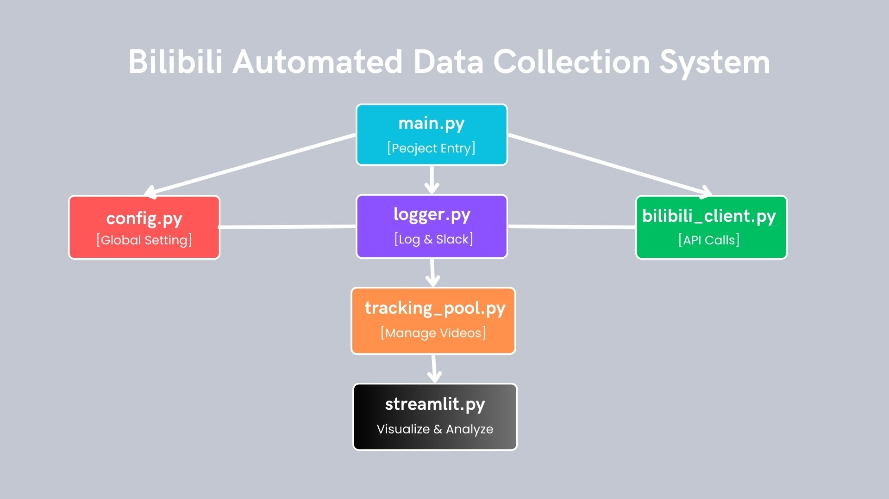
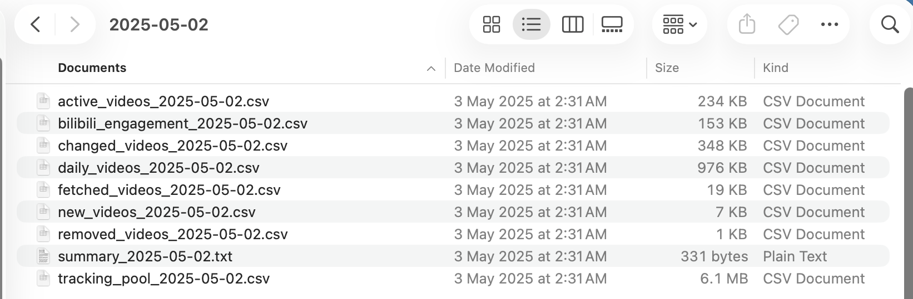
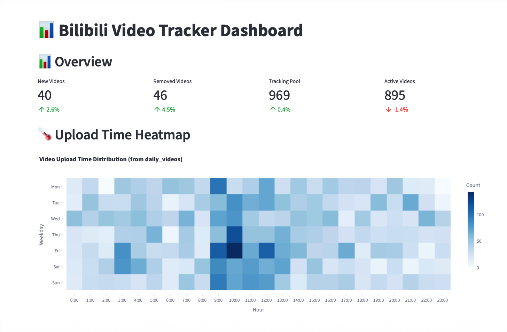
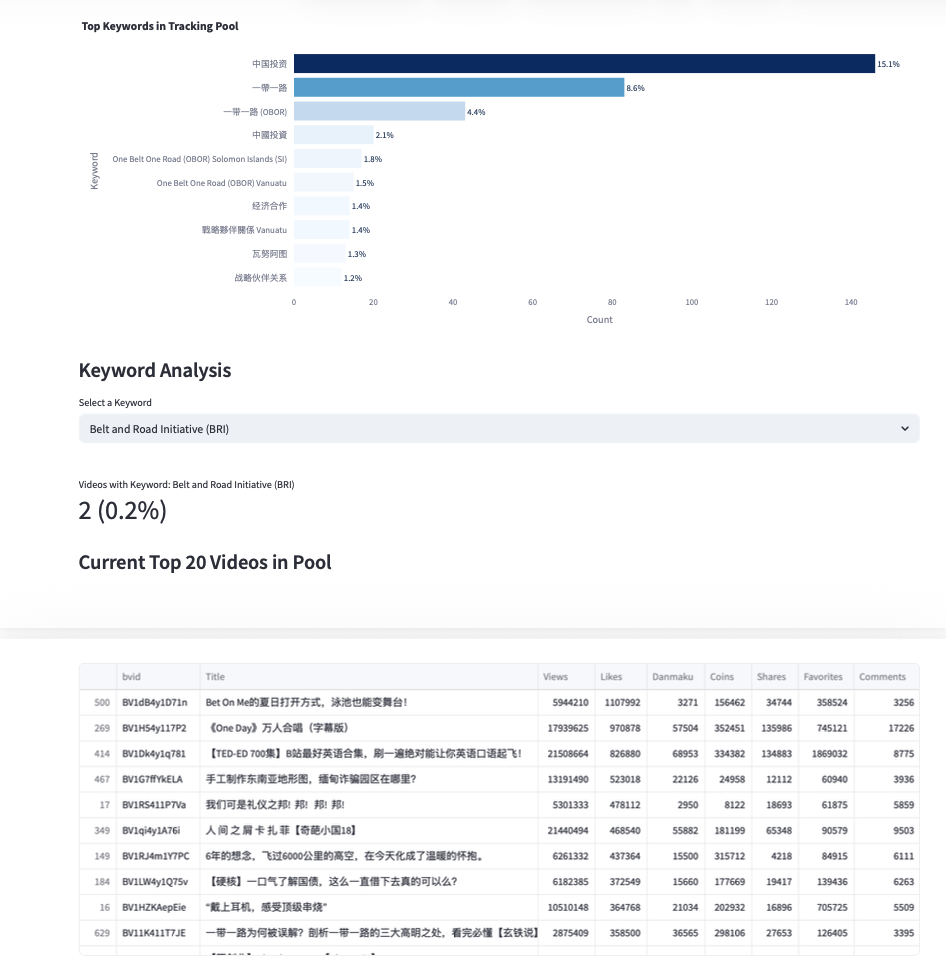

# Bilibili Video Data Pipeline


⭐ Automated Bilibili video data collection and engagement tracking system  
📊 72,000+ videos collected from keyword-based crawling  
📈 10,530 videos continuously tracked for engagement changes  
📉 Automatic detection of inactive videos (72-hour inactivity rule)  
📊 Interactive Streamlit dashboard for data exploration and trend analysis  

This project builds a complete automated data pipeline for collecting, tracking, analyzing, and visualizing engagement data of videos on the Bilibili platform.

The system combines web crawling, data processing, daily engagement tracking, automated data cleaning, and visualization to study video lifecycle patterns and keyword-based content trends.

---

# Project Overview

This project was designed to analyze video engagement dynamics on Bilibili through a large-scale automated pipeline.

The workflow includes three main stages:

1. **Large-scale video data collection**
2. **Daily engagement tracking and inactive video detection**
3. **Interactive visualization and trend analysis**

The system initially collected approximately:

- **285 keywords**  
  (topic keywords, location keywords, and topic + location combinations)

- **72,000 videos** from Bilibili search APIs

After data cleaning and filtering, **10,530 videos** were selected and placed into a tracking pool for continuous monitoring.

Every day the system automatically:

- updates engagement metrics
- detects inactive videos (72-hour inactivity rule)
- discovers newly uploaded videos
- updates the tracking pool
- generates structured datasets
- refreshes dashboard visualizations

---

# System Architecture

The following diagram illustrates the architecture of the system pipeline.



The system consists of several modular components:

| Module | Description |
|------|-------------|
| main.py | Project entry point controlling the daily pipeline |
| config.py | Global configuration settings |
| logger.py | Logging system and Slack notifications |
| bilibili_client.py | Handles API requests to Bilibili |
| tracking_pool.py | Manages the video tracking database and history |
| streamlit.py | Interactive visualization dashboard |

The architecture separates **data collection**, **tracking logic**, and **visualization**, making the pipeline modular and easy to extend.

---

# Project Structure

```
bilibili-video-data-pipeline
│
├── dashboard
│ └── streamlit.py # Streamlit visualization dashboard
│
├── images
│ ├── architecture.png
│ ├── daily_snapshot_files.png
│ ├── dashboard_overview.png
│ └── keyword_analysis.png
│
├── stage1_data_collection
│ └── bilibili_requests.py # Initial large-scale data crawling
│
├── tracker
│ ├── bilibili_client.py # API request module
│ ├── config.py # Global configuration
│ ├── logger.py # Logging and Slack integration
│ ├── main.py # Pipeline entry script
│ └── tracking_pool.py # Video tracking manager
│
├── requirements.txt
├── .gitignore
└── README.md
```


---

# Stage 1: Video Data Collection

The first stage collects videos from Bilibili using keyword-based searches.

Keywords include:

- topic keywords
- location keywords
- topic + location combinations

Total keywords used:

**285 keywords**

The crawler retrieves video metadata using Bilibili public APIs.

Data collected for each video includes:

- Video ID (BVID)
- Title
- Description
- Upload time
- Engagement metrics
  - views
  - likes
  - coins
  - shares
  - favorites
  - danmaku
  - comments
- Author information
  - user ID
  - username
  - follower count

Example APIs used:
```
Video search API
https://api.bilibili.com/x/web-interface/search/type
Video details API
https://api.bilibili.com/x/web-interface/view
User information API
https://api.bilibili.com/x/web-interface/card
Video comments API
https://api.bilibili.com/x/v2/reply
```


The collected data is exported to structured formats such as:

- JSON
- CSV
- Excel

These datasets serve as the input for the engagement tracking stage.

---

# Stage 2: Daily Engagement Tracking

After the initial dataset is built, the system performs **daily engagement tracking**.

The pipeline automatically executes the following tasks:

1. Load newly discovered videos
2. Merge them into the **tracking pool**
3. Update engagement metrics
4. Record daily engagement history
5. Remove inactive videos

Inactive videos are detected using a **72-hour inactivity rule**:

If a video shows **no engagement growth for three consecutive days**, it is automatically removed from the tracking pool.

This allows the system to focus on actively evolving content.

---

# Daily Data Snapshot

Each execution generates structured datasets stored in:
```
daily_snapshots/{date}/
```
Example files include:
```
active_videos_DATE.csv
new_videos_DATE.csv
removed_videos_DATE.csv
daily_videos_DATE.csv
tracking_pool_DATE.csv
summary_DATE.txt
```


Example output directory:



These daily snapshots provide a complete history of engagement changes and system decisions.

---

# Dashboard Visualization

An interactive dashboard is implemented using **Streamlit**.

The dashboard enables exploration of the collected data and engagement trends.

Main dashboard features include:

- Daily tracking statistics
- Number of new and removed videos
- Engagement trend analysis
- Top performing videos
- Keyword-based filtering
- Tracking pool statistics

Example dashboard interface:



---

# Keyword Analysis

The dashboard also includes keyword-level analytics.

Users can explore:

- keyword popularity
- number of videos per keyword
- average engagement levels
- top performing videos under each keyword

Example keyword analysis view:



This helps reveal content trends across different topics.

---

# Engagement Prediction

The system also supports simple engagement forecasting using **Linear Regression**.

The model predicts engagement trends for:

- 1 day
- 3 days
- 7 days

Predicted values are displayed alongside historical data in the dashboard.

This functionality helps identify potential viral content and understand engagement growth patterns.

---

# Technology Stack

The project uses the following technologies:

| Category | Technology |
|------|-------------|
| Programming | Python |
| Data Collection | Requests |
| Data Processing | Pandas |
| Visualization | Streamlit |
| Charts | Plotly |
| Machine Learning | Scikit-learn |
| Notification | Slack Webhook |
| Environment | Ubuntu Virtual Machine |

---

# AI-Assisted Development

This project was developed with assistance from **ChatGPT** for:

- architecture planning
- debugging and optimization
- documentation writing
- pipeline design discussion

ChatGPT was used as a development assistant to accelerate problem solving and improve code structure, while all design decisions and system integration were implemented manually.

---

# Installation

Clone the repository:
git clone https://github.com/yourusername/bilibili-video-data-pipeline.git

Install dependencies:
pip install -r requirements.txt


---

# Running the Pipeline

Run the tracking system:
python tracker/main.py


Launch the Streamlit dashboard:
streamlit run dashboard/streamlit.py


---

# Future Improvements

Potential extensions include:

- sentiment analysis on comments and danmaku
- advanced engagement prediction models
- real-time data streaming
- integration with additional video platforms
- automated reporting and alert systems

---

# Research Applications

This pipeline can support multiple research and practical applications:

- video lifecycle analysis
- content trend detection
- recommendation system research
- social media communication studies
- public opinion monitoring
- keyword-based content analytics

---

# Summary

This project implements a complete automated pipeline for collecting, tracking, analyzing, and visualizing engagement data of Bilibili videos.

The system demonstrates a full data workflow including:

- large-scale web crawling
- automated data cleaning
- daily engagement tracking
- dashboard visualization
- engagement prediction

It provides a strong foundation for video content analytics and social media research.